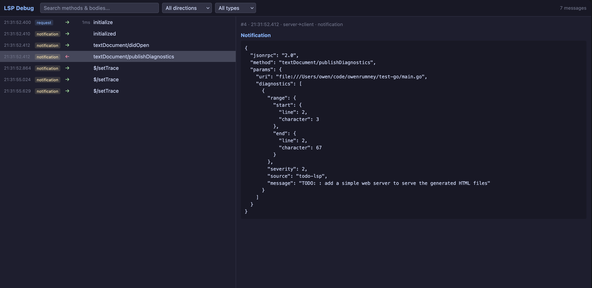

# go-lsp

A Go library for building [Language Server Protocol](https://microsoft.github.io/language-server-protocol/specifications/lsp/3.16/specification/) servers. It handles JSON-RPC framing, message dispatch, and LSP type definitions so you can focus on your language logic.

This library targets **LSP 3.17**. The table below shows which parts of the specification are currently supported.

## Contents

- [go-lsp](#go-lsp)
	- [Contents](#contents)
		- [LSP support](#lsp-support)
	- [Installation](#installation)
	- [Quick start](#quick-start)
	- [Transports](#transports)
	- [Handler interfaces](#handler-interfaces)
		- [Lifecycle (required)](#lifecycle-required)
		- [Text document sync](#text-document-sync)
		- [Language features](#language-features)
		- [Workspace](#workspace)
	- [Server-to-client communication](#server-to-client-communication)
	- [Custom methods](#custom-methods)
	- [Debug UI](#debug-ui)
	- [Project structure](#project-structure)

### LSP support

| Category | Feature | Supported |
|---|---|:---:|
| **Lifecycle** | initialize / shutdown / exit | Yes |
| | $/cancelRequest | Yes |
| | $/setTrace | Yes |
| **Text Document Sync** | didOpen / didChange / didClose | Yes |
| | didSave | Yes |
| | willSave / willSaveWaitUntil | Yes |
| **Language Features** | completion | Yes |
| | completionItem/resolve | Yes |
| | hover | Yes |
| | signatureHelp | Yes |
| | declaration | Yes |
| | definition | Yes |
| | typeDefinition | Yes |
| | implementation | Yes |
| | references | Yes |
| | documentHighlight | Yes |
| | documentSymbol | Yes |
| | codeAction | Yes |
| | codeAction/resolve | Yes |
| | codeLens | Yes |
| | codeLens/resolve | Yes |
| | documentLink | Yes |
| | documentLink/resolve | Yes |
| | documentColor / colorPresentation | Yes |
| | formatting | Yes |
| | rangeFormatting | Yes |
| | onTypeFormatting | Yes |
| | rename | Yes |
| | prepareRename | Yes |
| | foldingRange | Yes |
| | selectionRange | Yes |
| | callHierarchy | Yes |
| | semanticTokens (full / delta / range) | Yes |
| | linkedEditingRange | Yes |
| | moniker | Yes |
| **Workspace** | workspaceSymbol | Yes |
| | executeCommand | Yes |
| | didChangeWorkspaceFolders | Yes |
| | didChangeConfiguration | Yes |
| | didChangeWatchedFiles | Yes |
| | workspace/willCreateFiles | Yes |
| | workspace/willRenameFiles | Yes |
| | workspace/willDeleteFiles | Yes |
| **Window** | showMessage (server-to-client) | Yes |
| | showMessageRequest | Yes |
| | logMessage | Yes |
| | progress | Yes |
| | showDocument | Yes |
| **Diagnostics** | publishDiagnostics (server-to-client) | Yes |
| **LSP 3.17** | | |
| **Language Features** | typeHierarchy (prepare / supertypes / subtypes) | Yes |
| | inlayHint | Yes |
| | inlayHint/resolve | Yes |
| | inlineValue | Yes |
| | textDocument/diagnostic (pull) | Yes |
| **Workspace** | workspace/diagnostic | Yes |
| | workspace/codeLens/refresh | Yes |
| | workspace/semanticTokens/refresh | Yes |
| | workspace/inlayHint/refresh | Yes |
| | workspace/inlineValue/refresh | Yes |
| | workspace/diagnostic/refresh | Yes |

## Installation

```
go get github.com/owenrumney/go-lsp
```

## Quick start

Define a handler struct that implements `server.LifecycleHandler` and any optional interfaces you need, then pass it to `NewServer`:

```go
package main

import (
	"context"
	"os"

	"github.com/owenrumney/go-lsp/lsp"
	"github.com/owenrumney/go-lsp/server"
)

type Handler struct{}

func (h *Handler) Initialize(ctx context.Context, params *lsp.InitializeParams) (*lsp.InitializeResult, error) {
	return &lsp.InitializeResult{
		Capabilities: lsp.ServerCapabilities{
			HoverProvider: &lsp.HoverOptions{},
		},
	}, nil
}

func (h *Handler) Shutdown(ctx context.Context) error {
	return nil
}

func (h *Handler) Hover(ctx context.Context, params *lsp.HoverParams) (*lsp.Hover, error) {
	return &lsp.Hover{
		Contents: lsp.MarkupContent{
			Kind:  lsp.MarkupKindMarkdown,
			Value: "Hello from the server",
		},
	}, nil
}


func main() {
	srv := server.NewServer(&Handler{})

	if err := srv.Run(context.Background(), server.RunStdio()); err != nil {
		os.Exit(1)
	}
}
```

## Transports

The server accepts any `io.ReadWriteCloser`, so you can use it with stdio, TCP, WebSockets, or anything else:

```go
// Stdio (most common for editors)
srv.Run(ctx, stdRWC{})

// TCP
ln, _ := net.Listen("tcp", ":9999")
conn, _ := ln.Accept()
srv.Run(ctx, conn) // net.Conn implements io.ReadWriteCloser

// WebSocket (using nhooyr.io/websocket)
ws, _ := websocket.Accept(w, r, nil)
srv.Run(ctx, websocket.NetConn(ctx, ws, websocket.MessageText))
```

The server automatically advertises capabilities based on which interfaces your handler implements. If your handler satisfies `HoverHandler`, the server tells the client it supports hover -- you don't need to wire that up yourself. You can still set capabilities explicitly in `Initialize` if you need finer control; explicit values take precedence.

## Handler interfaces

`LifecycleHandler` is the only required interface. Everything else is opt-in: implement the interface on your handler struct and the server registers the corresponding LSP method automatically.

### Lifecycle (required)

| Interface | Methods |
|---|---|
| `LifecycleHandler` | `Initialize`, `Shutdown` |
| `SetTraceHandler` | `SetTrace` |

### Text document sync

| Interface | Methods |
|---|---|
| `TextDocumentSyncHandler` | `DidOpen`, `DidChange`, `DidClose` |
| `TextDocumentSaveHandler` | `DidSave` |
| `TextDocumentWillSaveHandler` | `WillSave` |
| `TextDocumentWillSaveWaitUntilHandler` | `WillSaveWaitUntil` |

### Language features

| Interface | Methods |
|---|---|
| `CompletionHandler` | `Completion` |
| `CompletionResolveHandler` | `ResolveCompletionItem` |
| `HoverHandler` | `Hover` |
| `SignatureHelpHandler` | `SignatureHelp` |
| `DeclarationHandler` | `Declaration` |
| `DefinitionHandler` | `Definition` |
| `TypeDefinitionHandler` | `TypeDefinition` |
| `ImplementationHandler` | `Implementation` |
| `ReferencesHandler` | `References` |
| `DocumentHighlightHandler` | `DocumentHighlight` |
| `DocumentSymbolHandler` | `DocumentSymbol` |
| `CodeActionHandler` | `CodeAction` |
| `CodeActionResolveHandler` | `ResolveCodeAction` |
| `CodeLensHandler` | `CodeLens` |
| `CodeLensResolveHandler` | `ResolveCodeLens` |
| `DocumentLinkHandler` | `DocumentLink` |
| `DocumentLinkResolveHandler` | `ResolveDocumentLink` |
| `DocumentColorHandler` | `DocumentColor` |
| `ColorPresentationHandler` | `ColorPresentation` |
| `DocumentFormattingHandler` | `Formatting` |
| `DocumentRangeFormattingHandler` | `RangeFormatting` |
| `DocumentOnTypeFormattingHandler` | `OnTypeFormatting` |
| `RenameHandler` | `Rename` |
| `PrepareRenameHandler` | `PrepareRename` |
| `FoldingRangeHandler` | `FoldingRange` |
| `SelectionRangeHandler` | `SelectionRange` |
| `CallHierarchyHandler` | `PrepareCallHierarchy`, `IncomingCalls`, `OutgoingCalls` |
| `SemanticTokensFullHandler` | `SemanticTokensFull` |
| `SemanticTokensDeltaHandler` | `SemanticTokensDelta` |
| `SemanticTokensRangeHandler` | `SemanticTokensRange` |
| `LinkedEditingRangeHandler` | `LinkedEditingRange` |
| `MonikerHandler` | `Moniker` |
| `TypeHierarchyHandler` | `PrepareTypeHierarchy`, `Supertypes`, `Subtypes` |
| `InlayHintHandler` | `InlayHint` |
| `InlayHintResolveHandler` | `ResolveInlayHint` |
| `InlineValueHandler` | `InlineValue` |
| `DocumentDiagnosticHandler` | `DocumentDiagnostic` |

### Workspace

| Interface | Methods |
|---|---|
| `WorkspaceSymbolHandler` | `WorkspaceSymbol` |
| `ExecuteCommandHandler` | `ExecuteCommand` |
| `WorkspaceFoldersHandler` | `DidChangeWorkspaceFolders` |
| `DidChangeConfigurationHandler` | `DidChangeConfiguration` |
| `DidChangeWatchedFilesHandler` | `DidChangeWatchedFiles` |
| `WillCreateFilesHandler` | `WillCreateFiles` |
| `WillRenameFilesHandler` | `WillRenameFiles` |
| `WillDeleteFilesHandler` | `WillDeleteFiles` |
| `WorkspaceDiagnosticHandler` | `WorkspaceDiagnostic` |

## Server-to-client communication

After the server starts, `srv.Client` is available for sending notifications and requests back to the editor:

```go
// Publish diagnostics for a file
srv.Client.PublishDiagnostics(ctx, &lsp.PublishDiagnosticsParams{
	URI:         "file:///path/to/file.go",
	Diagnostics: diagnostics,
})

// Show a message popup in the editor
srv.Client.ShowMessage(ctx, &lsp.ShowMessageParams{
	Type:    lsp.MessageTypeInfo,
	Message: "Indexing complete",
})

// Write to the editor's log output
srv.Client.LogMessage(ctx, &lsp.LogMessageParams{
	Type:    lsp.MessageTypeLog,
	Message: "processed 42 files",
})

// Report progress
srv.Client.Progress(ctx, &lsp.ProgressParams{
	Token: "indexing",
	Value: progressValue,
})

// Show a message with action buttons (request/response)
item, err := srv.Client.ShowMessageRequest(ctx, &lsp.ShowMessageRequestParams{
	Type:    lsp.MessageTypeInfo,
	Message: "Restart server?",
	Actions: []lsp.MessageActionItem{{Title: "Yes"}, {Title: "No"}},
})

// Ask the editor to show a document
result, err := srv.Client.ShowDocument(ctx, &lsp.ShowDocumentParams{
	URI: "file:///path/to/file.go",
})
```

## Custom methods

You can register custom JSON-RPC methods and notifications for server-specific extensions:

```go
srv := server.NewServer(&handler{})

// Custom request method
srv.HandleMethod("custom/myMethod", func(ctx context.Context, params json.RawMessage) (any, error) {
	var p MyParams
	if err := json.Unmarshal(params, &p); err != nil {
		return nil, err
	}
	return MyResult{Value: "hello"}, nil
})

// Custom notification
srv.HandleNotification("custom/myNotification", func(ctx context.Context, params json.RawMessage) error {
	// handle notification
	return nil
})

srv.Run(ctx, rwc)
```

Custom handlers must be registered before calling `Run`.

## Debug UI

The library includes an optional debug UI that captures all LSP traffic and displays it in a web interface. This is useful for inspecting the messages flowing between client and server during development.

Enable it with the `WithDebugUI` option:

```go
srv := server.NewServer(&Handler{}, server.WithDebugUI(":7100"))
srv.Run(ctx, server.RunStdio())
```

Then open `http://localhost:7100` in a browser. The UI shows messages in real time via WebSocket, with:

- Request/response pairing with latency tracking
- Direction and type filters
- Full-text search across methods and JSON bodies
- Pretty-printed message details

The tap is transparent -- it intercepts LSP frames for display without modifying them.



## Project structure

The library is split into three packages:

- **`jsonrpc`** -- JSON-RPC 2.0 framing over an `io.ReadWriteCloser`, with method and notification dispatch.
- **`lsp`** -- Go types for LSP structures (capabilities, params, results, enums). No logic, just data definitions.
- **`server`** -- The `Server` that ties it together: accepts a handler, registers LSP methods based on the interfaces it implements, and manages the connection lifecycle.
