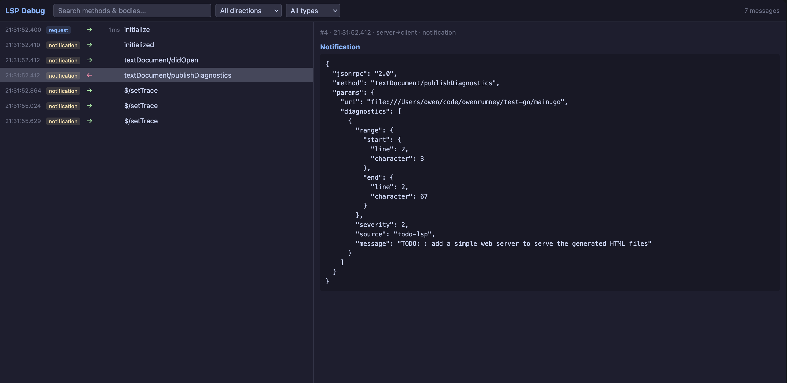
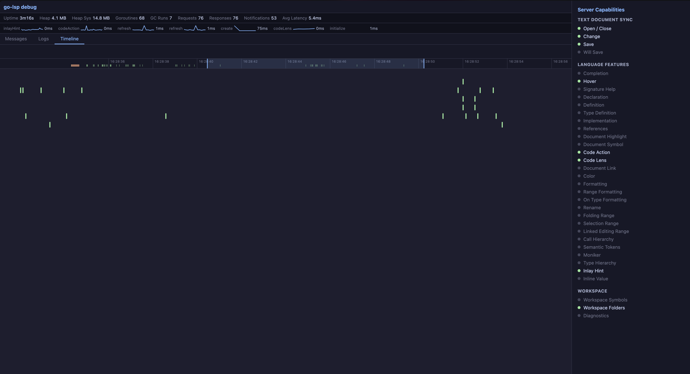

# go-lsp

A Go library for building [Language Server Protocol](https://microsoft.github.io/language-server-protocol/specifications/lsp/3.17/specification/) servers. It handles JSON-RPC framing, message dispatch, open document state, and LSP type definitions so you can focus on your language logic.

This library targets **LSP 3.17**. The table below shows which parts of the specification are currently supported.

## Contents

- [go-lsp](#go-lsp)
	- [Contents](#contents)
		- [LSP support](#lsp-support)
	- [Installation](#installation)
	- [Quick start](#quick-start)
	- [Transports](#transports)
	- [Document management](#document-management)
	- [Handler interfaces](#handler-interfaces)
		- [Lifecycle (required)](#lifecycle-required)
		- [Text document sync](#text-document-sync)
		- [Language features](#language-features)
		- [Workspace](#workspace)
	- [Server-to-client communication](#server-to-client-communication)
	- [Custom methods](#custom-methods)
	- [Logging](#logging)
	- [Testing](#testing)
	- [Debug UI](#debug-ui)
	- [Project structure](#project-structure)

### LSP support

| Category | Feature | Supported |
|---|---|:---:|
| **Lifecycle** | initialize / shutdown / exit | Yes |
| | $/cancelRequest | Yes |
| | $/setTrace | Yes |
| **Text Document Sync** | didOpen / didChange / didClose | Yes |
| | didSave | Yes |
| | willSave / willSaveWaitUntil | Yes |
| **Language Features** | completion | Yes |
| | completionItem/resolve | Yes |
| | hover | Yes |
| | signatureHelp | Yes |
| | declaration | Yes |
| | definition | Yes |
| | typeDefinition | Yes |
| | implementation | Yes |
| | references | Yes |
| | documentHighlight | Yes |
| | documentSymbol | Yes |
| | codeAction | Yes |
| | codeAction/resolve | Yes |
| | codeLens | Yes |
| | codeLens/resolve | Yes |
| | documentLink | Yes |
| | documentLink/resolve | Yes |
| | documentColor / colorPresentation | Yes |
| | formatting | Yes |
| | rangeFormatting | Yes |
| | onTypeFormatting | Yes |
| | rename | Yes |
| | prepareRename | Yes |
| | foldingRange | Yes |
| | selectionRange | Yes |
| | callHierarchy | Yes |
| | semanticTokens (full / delta / range) | Yes |
| | linkedEditingRange | Yes |
| | moniker | Yes |
| **Workspace** | workspaceSymbol | Yes |
| | executeCommand | Yes |
| | didChangeWorkspaceFolders | Yes |
| | didChangeConfiguration | Yes |
| | didChangeWatchedFiles | Yes |
| | workspace/willCreateFiles | Yes |
| | workspace/willRenameFiles | Yes |
| | workspace/willDeleteFiles | Yes |
| **Window** | showMessage (server-to-client) | Yes |
| | showMessageRequest | Yes |
| | logMessage | Yes |
| | progress | Yes |
| | showDocument | Yes |
| **Diagnostics** | publishDiagnostics (server-to-client) | Yes |
| **LSP 3.17** | | |
| **Language Features** | typeHierarchy (prepare / supertypes / subtypes) | Yes |
| | inlayHint | Yes |
| | inlayHint/resolve | Yes |
| | inlineValue | Yes |
| | textDocument/diagnostic (pull) | Yes |
| **Workspace** | workspace/diagnostic | Yes |
| | workspace/codeLens/refresh | Yes |
| | workspace/semanticTokens/refresh | Yes |
| | workspace/inlayHint/refresh | Yes |
| | workspace/inlineValue/refresh | Yes |
| | workspace/diagnostic/refresh | Yes |

## Installation

```
go get github.com/owenrumney/go-lsp
```

## Documentation

The GitHub Pages docs site covers getting started, document management, capabilities, testing, debugging, and examples:

https://owenrumney.github.io/go-lsp/

## Quick start

Define a handler struct that implements `server.LifecycleHandler` and any optional interfaces you need, then pass it to `NewServer`:

```go
package main

import (
	"context"
	"os"

	"github.com/owenrumney/go-lsp/lsp"
	"github.com/owenrumney/go-lsp/server"
)

type Handler struct{}

func (h *Handler) Initialize(ctx context.Context, params *lsp.InitializeParams) (*lsp.InitializeResult, error) {
	return &lsp.InitializeResult{
		Capabilities: lsp.ServerCapabilities{
			HoverProvider: &lsp.HoverOptions{},
		},
	}, nil
}

func (h *Handler) Shutdown(ctx context.Context) error {
	return nil
}

func (h *Handler) Hover(ctx context.Context, params *lsp.HoverParams) (*lsp.Hover, error) {
	return &lsp.Hover{
		Contents: lsp.MarkupContent{
			Kind:  lsp.Markdown,
			Value: "Hello from the server",
		},
	}, nil
}


func main() {
	srv := server.NewServer(&Handler{})

	if err := srv.Run(context.Background(), server.RunStdio()); err != nil {
		os.Exit(1)
	}
}
```

## Transports

The server accepts any `io.ReadWriteCloser`, so you can use it with stdio, TCP, WebSockets, or anything else:

```go
// Stdio (most common for editors)
srv.Run(ctx, stdRWC{})

// TCP
ln, _ := net.Listen("tcp", ":9999")
conn, _ := ln.Accept()
srv.Run(ctx, conn) // net.Conn implements io.ReadWriteCloser

// WebSocket (using nhooyr.io/websocket)
ws, _ := websocket.Accept(w, r, nil)
srv.Run(ctx, websocket.NetConn(ctx, ws, websocket.MessageText))
```

The server automatically advertises capabilities based on which interfaces your handler implements. If your handler satisfies `HoverHandler`, the server tells the client it supports hover -- you don't need to wire that up yourself. You can still set capabilities explicitly in `Initialize` if you need finer control; explicit values take precedence.

Some capabilities need extra metadata that cannot be inferred from interfaces alone, such as completion trigger characters, command IDs, semantic token legends, or file operation filters. Configure those with server options:

```go
srv := server.NewServer(h,
	server.WithCompletionOptions(lsp.CompletionOptions{
		TriggerCharacters: []string{".", ":"},
	}),
	server.WithExecuteCommandOptions(lsp.ExecuteCommandOptions{
		Commands: []string{"mylang.generateDebugBundle"},
	}),
	server.WithSemanticTokensOptions(lsp.SemanticTokensOptions{
		Legend: lsp.SemanticTokensLegend{
			TokenTypes:     []string{"type", "function", "variable"},
			TokenModifiers: []string{"declaration", "readonly"},
		},
	}),
	server.WithFileOperationFilters([]lsp.FileOperationFilter{
		{Pattern: lsp.FileOperationPattern{Glob: "**/*.mylang"}},
	}),
)
```

Capability options only advertise features your handler actually implements. Explicit capabilities returned from `Initialize` still take precedence over auto-detected and option-provided capabilities.

LSP defaults to UTF-16 positions. If your server deliberately uses another LSP 3.17 position encoding, advertise it explicitly:

```go
srv := server.NewServer(h,
	server.WithPositionEncoding(lsp.PositionEncodingUTF8),
)
```

## Document management

Use `document.Store` to track open text documents and apply LSP change events. The store supports full and incremental sync, is safe to use from concurrent handlers, and converts between byte offsets and LSP positions using UTF-16 character offsets. See the [document guide](docs/documents.md) for details.

```go
type Handler struct {
	docs *document.Store
}

func NewHandler() *Handler {
	return &Handler{docs: document.NewStore()}
}

func (h *Handler) DidOpen(_ context.Context, params *lsp.DidOpenTextDocumentParams) error {
	_, err := h.docs.Open(params)
	return err
}

func (h *Handler) DidChange(_ context.Context, params *lsp.DidChangeTextDocumentParams) error {
	_, err := h.docs.Change(params)
	return err
}

func (h *Handler) DidClose(_ context.Context, params *lsp.DidCloseTextDocumentParams) error {
	h.docs.Close(params)
	return nil
}

func (h *Handler) Hover(_ context.Context, params *lsp.HoverParams) (*lsp.Hover, error) {
	doc, ok := h.docs.Get(params.TextDocument.URI)
	if !ok {
		return nil, nil
	}

	offset, err := doc.OffsetAt(params.Position)
	if err != nil {
		return nil, err
	}

	_ = offset // use the byte offset with your parser or index
	return nil, nil
}
```

LSP positions are not Go byte offsets or rune indexes. `Document.OffsetAt` and `Document.PositionAt` handle characters outside the BMP, such as emoji, correctly.

## Handler interfaces

`LifecycleHandler` is the only required interface. Everything else is opt-in: implement the interface on your handler struct and the server registers the corresponding LSP method automatically.

### Lifecycle (required)

| Interface | Methods |
|---|---|
| `LifecycleHandler` | `Initialize`, `Shutdown` |
| `SetTraceHandler` | `SetTrace` |

### Text document sync

| Interface | Methods |
|---|---|
| `TextDocumentSyncHandler` | `DidOpen`, `DidChange`, `DidClose` |
| `TextDocumentSaveHandler` | `DidSave` |
| `TextDocumentWillSaveHandler` | `WillSave` |
| `TextDocumentWillSaveWaitUntilHandler` | `WillSaveWaitUntil` |

### Language features

| Interface | Methods |
|---|---|
| `CompletionHandler` | `Completion` |
| `CompletionResolveHandler` | `ResolveCompletionItem` |
| `HoverHandler` | `Hover` |
| `SignatureHelpHandler` | `SignatureHelp` |
| `DeclarationHandler` | `Declaration` |
| `DefinitionHandler` | `Definition` |
| `TypeDefinitionHandler` | `TypeDefinition` |
| `ImplementationHandler` | `Implementation` |
| `ReferencesHandler` | `References` |
| `DocumentHighlightHandler` | `DocumentHighlight` |
| `DocumentSymbolHandler` | `DocumentSymbol` |
| `CodeActionHandler` | `CodeAction` |
| `CodeActionResolveHandler` | `ResolveCodeAction` |
| `CodeLensHandler` | `CodeLens` |
| `CodeLensResolveHandler` | `ResolveCodeLens` |
| `DocumentLinkHandler` | `DocumentLink` |
| `DocumentLinkResolveHandler` | `ResolveDocumentLink` |
| `DocumentColorHandler` | `DocumentColor` |
| `ColorPresentationHandler` | `ColorPresentation` |
| `DocumentFormattingHandler` | `Formatting` |
| `DocumentRangeFormattingHandler` | `RangeFormatting` |
| `DocumentOnTypeFormattingHandler` | `OnTypeFormatting` |
| `RenameHandler` | `Rename` |
| `PrepareRenameHandler` | `PrepareRename` |
| `FoldingRangeHandler` | `FoldingRange` |
| `SelectionRangeHandler` | `SelectionRange` |
| `CallHierarchyHandler` | `PrepareCallHierarchy`, `IncomingCalls`, `OutgoingCalls` |
| `SemanticTokensFullHandler` | `SemanticTokensFull` |
| `SemanticTokensDeltaHandler` | `SemanticTokensDelta` |
| `SemanticTokensRangeHandler` | `SemanticTokensRange` |
| `LinkedEditingRangeHandler` | `LinkedEditingRange` |
| `MonikerHandler` | `Moniker` |
| `TypeHierarchyHandler` | `PrepareTypeHierarchy`, `Supertypes`, `Subtypes` |
| `InlayHintHandler` | `InlayHint` |
| `InlayHintResolveHandler` | `ResolveInlayHint` |
| `InlineValueHandler` | `InlineValue` |
| `DocumentDiagnosticHandler` | `DocumentDiagnostic` |

### Workspace

| Interface | Methods |
|---|---|
| `WorkspaceSymbolHandler` | `WorkspaceSymbol` |
| `ExecuteCommandHandler` | `ExecuteCommand` |
| `WorkspaceFoldersHandler` | `DidChangeWorkspaceFolders` |
| `DidChangeConfigurationHandler` | `DidChangeConfiguration` |
| `DidChangeWatchedFilesHandler` | `DidChangeWatchedFiles` |
| `WillCreateFilesHandler` | `WillCreateFiles` |
| `WillRenameFilesHandler` | `WillRenameFiles` |
| `WillDeleteFilesHandler` | `WillDeleteFiles` |
| `WorkspaceDiagnosticHandler` | `WorkspaceDiagnostic` |

## Server-to-client communication

After the server starts, `srv.Client` is available for sending notifications and requests back to the editor:

```go
// Publish diagnostics for a file
srv.Client.PublishDiagnostics(ctx, &lsp.PublishDiagnosticsParams{
	URI:         "file:///path/to/file.go",
	Diagnostics: diagnostics,
})

// Show a message popup in the editor
srv.Client.ShowMessage(ctx, &lsp.ShowMessageParams{
	Type:    lsp.MessageTypeInfo,
	Message: "Indexing complete",
})

// Write to the editor's log output
srv.Client.LogMessage(ctx, &lsp.LogMessageParams{
	Type:    lsp.MessageTypeLog,
	Message: "processed 42 files",
})

// Report progress
srv.Client.Progress(ctx, &lsp.ProgressParams{
	Token: "indexing",
	Value: progressValue,
})

// Show a message with action buttons (request/response)
item, err := srv.Client.ShowMessageRequest(ctx, &lsp.ShowMessageRequestParams{
	Type:    lsp.MessageTypeInfo,
	Message: "Restart server?",
	Actions: []lsp.MessageActionItem{{Title: "Yes"}, {Title: "No"}},
})

// Ask the editor to show a document
result, err := srv.Client.ShowDocument(ctx, &lsp.ShowDocumentParams{
	URI: "file:///path/to/file.go",
})
```

## Custom methods

You can register custom JSON-RPC methods and notifications for server-specific extensions:

```go
srv := server.NewServer(&handler{})

// Custom request method
srv.HandleMethod("custom/myMethod", func(ctx context.Context, params json.RawMessage) (any, error) {
	var p MyParams
	if err := json.Unmarshal(params, &p); err != nil {
		return nil, err
	}
	return MyResult{Value: "hello"}, nil
})

// Custom notification
srv.HandleNotification("custom/myNotification", func(ctx context.Context, params json.RawMessage) error {
	// handle notification
	return nil
})

srv.Run(ctx, rwc)
```

Custom handlers must be registered before calling `Run`.

## Logging

The server supports structured logging via `log/slog`. Pass a logger with the `WithLogger` option:

```go
srv := server.NewServer(&handler{}, server.WithLogger(slog.Default()))
```

When enabled, the server logs:

| Event | Level | Attributes |
|---|---|---|
| Server starting | Info | |
| Initialized | Info | `serverName` |
| Shutdown | Info | |
| Method handled | Debug | `method`, `duration` |
| Notification handled | Debug | `method`, `duration` |
| Handler error | Error | `method`, `duration`, `error` |

If no logger is set, no logging is performed. Use any `slog.Handler` — JSON for production, text for development:

```go
// JSON to stderr
logger := slog.New(slog.NewJSONHandler(os.Stderr, nil))
srv := server.NewServer(&handler{}, server.WithLogger(logger))

// Debug-level text output
logger := slog.New(slog.NewTextHandler(os.Stderr, &slog.HandlerOptions{Level: slog.LevelDebug}))
srv := server.NewServer(&handler{}, server.WithLogger(logger))
```

## Testing

The `servertest` package provides a test harness that simulates an LSP client over in-memory pipes. It handles JSON-RPC framing, initialization, and cleanup automatically:

```go
func TestHover(t *testing.T) {
    h := servertest.New(t, &myHandler{})

    h.DidOpen("file:///test.txt", "plaintext", "hello world")

    hover, err := h.Hover("file:///test.txt", 0, 5)
    if err != nil {
        t.Fatal(err)
    }
    // assert on hover.Contents
}
```

The harness collects server-to-client notifications (diagnostics, messages) so you can assert on them:

```go
h.DidSave("file:///test.txt")

ctx, cancel := context.WithTimeout(context.Background(), 2*time.Second)
defer cancel()

diags, err := h.WaitForDiagnostics(ctx, "file:///test.txt")
```

See the [testing guide](docs/testing.md) for the full API.

## Debug UI

The library includes an optional debug UI that captures all LSP traffic and displays it in a web interface. This is useful for inspecting the messages flowing between client and server during development.

Enable it with the `WithDebugUI` option:

```go
srv := server.NewServer(&Handler{}, server.WithDebugUI(":7100"))
srv.Run(ctx, server.RunStdio())
```

Then open `http://localhost:7100` in a browser. The tap is transparent -- it intercepts LSP frames for display without modifying them.

If the HTTP listener cannot bind (port in use, locked-down environment), the server logs a warning and continues with capture-only mode. `WithDebugUI` therefore never prevents the LSP from starting; trace export still works against the in-memory recorder.

### Capture-only mode

If you want trace capture for support bundles or debugging exports but do not want to bind an HTTP port, use `WithDebugCapture`:

```go
srv := server.NewServer(&Handler{}, server.WithDebugCapture())
```

`WithDebugUI` implies `WithDebugCapture`, so you only need one or the other. Both feed the same recorder, which powers `SaveDebugTrace` / `ExportDebugTrace`.

### Messages tab

Real-time view of all JSON-RPC traffic between client and server:

- **Request/response pairing** -- responses are matched to their originating request with latency displayed inline
- **Direction and type filters** -- narrow the list to client-to-server, server-to-client, requests, or notifications
- **Full-text search** across methods and JSON bodies (including paired responses)
- **Pretty-printed detail pane** -- click any message to see the full JSON with syntax formatting

### Logs tab

Aggregated log output with level filtering (error, warning, info, log). `window/logMessage` notifications are automatically cross-posted here. Supports search and CSV export.

### Timeline tab

Waterfall view of request latency, grouped by method:

- Each method gets a single row with all its request bars laid out on a time track
- Bars are color-coded: green (<100ms), orange (100ms--1s), red (>1s), animated blue stripes (pending)
- **Minimap** header with time axis ticks -- click or drag to scroll to a point in time
- Zoom in/out to adjust the time scale
- Click any bar to jump to that message in the Messages tab

### Stats bar

Runtime metrics updated every 2 seconds: uptime, heap usage, goroutine count, GC runs, request/response/notification counts, and average latency.

**Method sparklines** appear below the stats bar once latency data is available, showing an inline SVG chart of the last 50 latency samples per method (top 10 by volume).

### Other features

- **Capabilities panel** -- slide-out panel showing which LSP capabilities the server advertised during initialization
- **Trace export** -- save a versioned JSON trace from your server with `SaveDebugTrace`
- **Dark / light theme** -- toggle between Catppuccin Mocha (dark) and Catppuccin Latte (light) themes, persisted in `localStorage`





### Saving traces

When `WithDebugCapture` or `WithDebugUI` is set, you can save the captured session programmatically:

```go
err := srv.SaveDebugTrace("/tmp/session.trace.json", server.TraceExportOptions{
	RedactDocumentText: true,
	RedactFilePaths:    true,
	Pretty:             true,
})
```

Use `ExportDebugTrace` if you want the JSON bytes instead of writing directly to disk. `SaveDebugTrace` writes files with `0600` permissions because traces may contain source code, local paths, and project details. If neither capture nor UI is enabled, these methods return `server.ErrDebugTraceUnavailable`.

## Project structure

The library is split into five packages:

- **`server`** -- The `Server` that ties it together: accepts a handler, registers LSP methods based on the interfaces it implements, and manages the connection lifecycle.
- **`lsp`** -- Go types for LSP structures (capabilities, params, results, enums). No logic, just data definitions.
- **`document`** -- Open text document storage, full/incremental change application, and UTF-16 LSP position conversion.
- **`servertest`** -- Test harness that simulates an LSP client over in-memory pipes for writing unit tests.
- **`internal/jsonrpc`** -- JSON-RPC 2.0 framing over an `io.ReadWriteCloser`, with method and notification dispatch.
