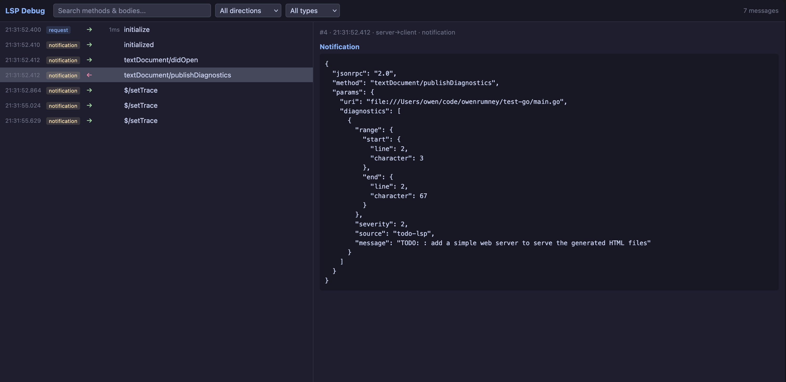

# go-lsp

`go-lsp` is a Go library for building Language Server Protocol servers in Go without reimplementing JSON-RPC transport, handler dispatch, document sync, or protocol types.

## Why use go-lsp?

- **Typed LSP handlers** instead of hand-rolled JSON-RPC plumbing
- **Auto-detected capabilities** from the interfaces your handler implements
- **Built-in document store** with full and incremental sync support
- **`servertest` harness** for end-to-end LSP tests over in-memory pipes
- **Project scaffold generator** to bootstrap a server quickly
- **Optional debug UI** for inspecting live LSP traffic

## Install

```bash
go get github.com/owenrumney/go-lsp
```

## Minimal server

```go
package main

import (
    "context"
    "log"

    "github.com/owenrumney/go-lsp/lsp"
    "github.com/owenrumney/go-lsp/server"
)

type Handler struct{}

func (h *Handler) Initialize(_ context.Context, _ *lsp.InitializeParams) (*lsp.InitializeResult, error) {
    return &lsp.InitializeResult{
        ServerInfo: &lsp.ServerInfo{Name: "example", Version: "0.1.0"},
    }, nil
}

func (h *Handler) Shutdown(_ context.Context) error { return nil }

func (h *Handler) Hover(_ context.Context, _ *lsp.HoverParams) (*lsp.Hover, error) {
    return &lsp.Hover{
        Contents: lsp.NewHoverContents(lsp.Markdown, "**hello**"),
    }, nil
}

func main() {
    srv := server.NewServer(&Handler{})
    if err := srv.Run(context.Background(), server.RunStdio()); err != nil {
        log.Fatal(err)
    }
}
```

Implement `server.HoverHandler`, `server.CompletionHandler`, `server.TextDocumentSyncHandler`, and other interfaces as needed. `go-lsp` registers methods and advertises capabilities automatically.

## Quick start

Generate a starter server:

```bash
go run github.com/owenrumney/go-lsp/cmd/scaffold@latest \
  --name mylang \
  --module github.com/you/mylang-lsp \
  --lang mylang \
  --features hover,completion,diagnostics
```

Run tests with the included harness:

```go
func TestHover(t *testing.T) {
    h := servertest.New(t, &Handler{})

    h.DidOpen("file:///test.txt", "plaintext", "hello")
    hover, err := h.Hover("file:///test.txt", 0, 0)
    if err != nil {
        t.Fatal(err)
    }
    if hover == nil {
        t.Fatal("expected hover result")
    }
}
```

## Feature highlights

### Server-to-client APIs

`server.Client` includes helpers for common outbound LSP calls, including:

- `PublishDiagnostics`
- `ShowMessage`, `LogMessage`, `ShowMessageRequest`
- `ShowDocument`
- `Configuration`
- `ApplyEdit`
- `RegisterCapability`, `UnregisterCapability`
- progress and refresh requests

### Middleware and request controls

`Server` supports optional inbound middleware and request concurrency controls:

- `server.WithMethodMiddleware(...)`
- `server.WithNotificationMiddleware(...)`
- `server.WithMaxConcurrentRequests(n)`
- `server.WithRequestTimeout(d)`

These are opt-in. Default behavior stays simple.

### Debug UI

The optional debug UI helps inspect LSP traffic while developing and testing.



## Start here

- Getting started: [`docs/getting-started.md`](./docs/getting-started.md)
- Testing guide: [`docs/testing.md`](./docs/testing.md)
- Examples: [`examples/`](./examples/)
- Package docs site: https://www.owenrumney.co.uk/go-lsp

## Examples

- [`examples/hover/`](./examples/hover/) — basic hover provider
- [`examples/completion/`](./examples/completion/) — completion + resolve
- [`examples/diagnostics/`](./examples/diagnostics/) — publish diagnostics on save
- [`examples/codeactions/`](./examples/codeactions/) — quick fixes and code actions
- [`examples/symbols/`](./examples/symbols/) — document symbols
- [`examples/toylang/`](./examples/toylang/) — multi-feature toy language server
